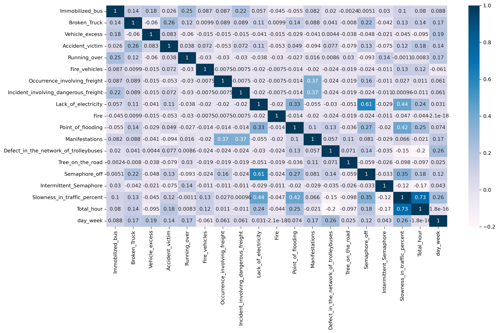

# Behaviour Analysis

## Project Overview
- Behavior analysis of the urban traffic of the city of Sao Paulo in Brazil. The data set was taken from **[UCI](https://archive.ics.uci.edu/ml/datasets/Behavior+of+the+urban+traffic+of+the+city+of+Sao+Paulo+in+Brazil)** Machine Learning Repository.
- The dataset contains records of behavior of the urban traffic of the city of Sao Paulo in Brazil from December 14, 2009 to December 18, 2009 (From Monday to Friday).
- The dataset contains 18 attributes for each interval of 30 minutes from 7AM to 20PM.
- EDA using Pandas, Numpy, Matplotlib and Seaborn and a Linear Regression model built using TensorFlow and Keras to predict the probability of slowness in traffic based on multiple inputs such as, vehicle excess, broken truck, lack of eletricity and so on in a certain hour and day. Access the Jupyter Notebook **[here](https://nbviewer.org/github/ThiPauli/Behavior_urban_traffic_Sao_Paulo_Brazil/blob/main/behaviour_urban_traffic_Sao_Paulo-Brazil.ipynb)**.

## Objectives
* Exploring the relationships between slowness in traffic with the attributes to understand the critical cases that influence such a issue.
* Building a basic model to predict the target (slowness in traffic).

## Exploratory Data Analysis and Data Cleaning

### Exploratory Data Analysis and Visualizations
After extracting, converting and adding hours and minutes for each day, it was possible to evaluate:
* Exploration of the correlation of the data

## Visualizations
* Monthly plot of the number of games relesed per year.

* Evaluating the top game developers by the amount of games released.

* Plotting the history of releasing games in Japan for the 1990 year.

## Conclusions
* The structure of the table from Wikipedia page (HTML document) is missing some table data, so it had to insert manually some items.
* The first game released in Japan was in November 1990 and the last one was in November 2000.
* Japan released more games.
* The peak of releasing was in 1994 for both Japan and North America.
* The PAL region is not precise because the release data only contain the year in many cases, so when converting the data for month, they automatically become the first month (January). Therefore, the PAL region graph shows peaks of releasing games in every years of January.
* Incredibly, Nintendo itself is not the most developer of SNES games.
* The classics Super Mario World and F-zero were the first games released in Super Nintendo history.
