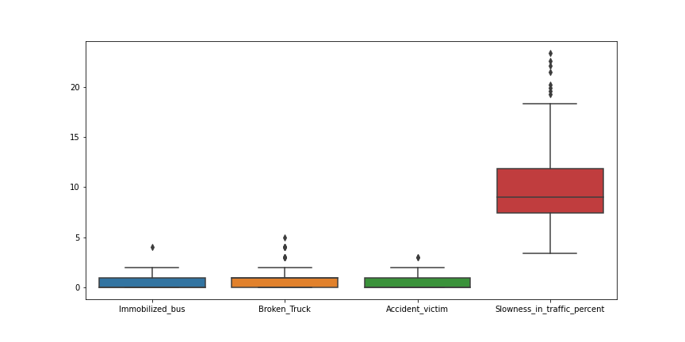

# Behaviour Analysis

## Project Overview
- Behavior analysis of the urban traffic of the city of Sao Paulo in Brazil. The data set was taken from **[UCI](https://archive.ics.uci.edu/ml/datasets/Behavior+of+the+urban+traffic+of+the+city+of+Sao+Paulo+in+Brazil)** Machine Learning Repository.
- The dataset contains records of behavior of the urban traffic of the city of Sao Paulo in Brazil from December 14, 2009 to December 18, 2009 (From Monday to Friday).
- The dataset contains 18 attributes for each interval of 30 minutes from 7AM to 8PM.
- EDA using Pandas, Numpy, Matplotlib and Seaborn and a Linear Regression model built using TensorFlow and Keras to predict the probability of slowness in traffic based on multiple inputs such as, vehicle excess, broken truck, lack of eletricity and so on in a certain hour and day. Access the Jupyter Notebook **[here](https://nbviewer.org/github/ThiPauli/Behavior_urban_traffic_Sao_Paulo_Brazil/blob/main/behaviour_urban_traffic_Sao_Paulo-Brazil.ipynb)**.

## Objectives
* Exploring the relationships between slowness in traffic with the attributes to understand the critical cases that influence such a issue.
* Building a basic model to predict the target (slowness in traffic).

## Exploratory Data Analysis and Visualizations
After extracting, converting and adding hours and minutes for each day, it was possible to evaluate:
* Exploration of the correlation of the data.

* Since there is a strong correlation between slowness in traffic and hour, it is relevant to visualize the average of slowness in traffic in each interval time.

* Additionally to observe relationship between hour and slowness in traffic in each day.

* Analysis of the distribution of the data: outliers were found in the 'Immobilized_bus', 'Broken_Truck', 'Accident_victim', 'Slowness_in_traffic_percent' variables.

## Linear Regression model
After the exploratory data analysis, it was created a Machine Learning model to predict the slowness in traffic (%) and compare with the real values.
* Dataset split into training and testing set.
* Mean absolute error (MAE) loss function used for this regression problem.
* After predicting, the model found the best fit linear.

* And also, the error distribution:

## Conclusions
* There is a strong correlation between slowness in traffic and hour as well as lack of energy, point of flooding and semaphore off. The correlation between lack of energy and semaphore off seems to be obvious and natural.
* The Correlation between slowness in traffic and day of the week is not so relevant comparing with the hour.
* Friday did not register peaks of slowness in traffic. Considering that people like to spend the weekend out of town, the trafic should have got worse. Apparently it might have result this because the data were colleted in a week which people spent the week in their homes.
* Even though there were 5 trucks broken (treated as an outlier) at 15:30 (3:30PM) on Tuesday, the slowness in traffic was not so high (only 8.4%).
* The model test result is a mean absolute error (MAE) of 1.97. This means it predicts slowness in traffic correctly within 1.97%. The error distribution shows the model got an error of almost -6(%) in one ocassion. True value is approx. 19(%) and the model predicted approx. 13(%).
